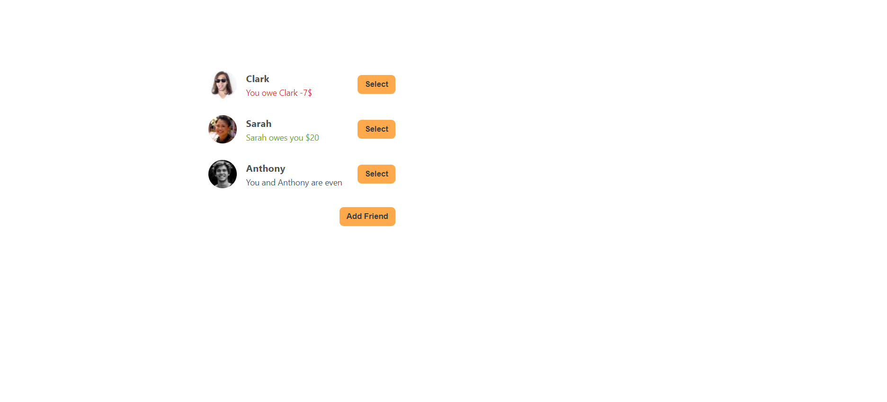
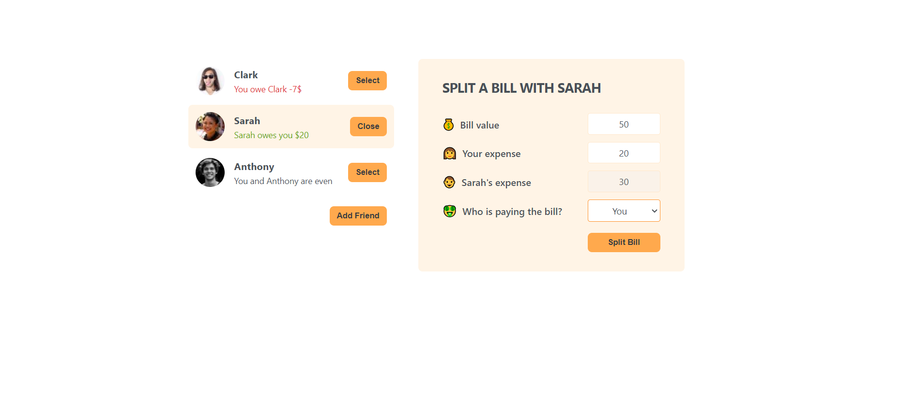
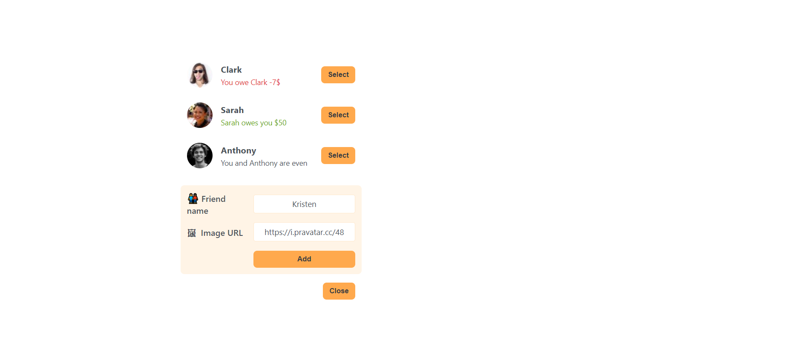
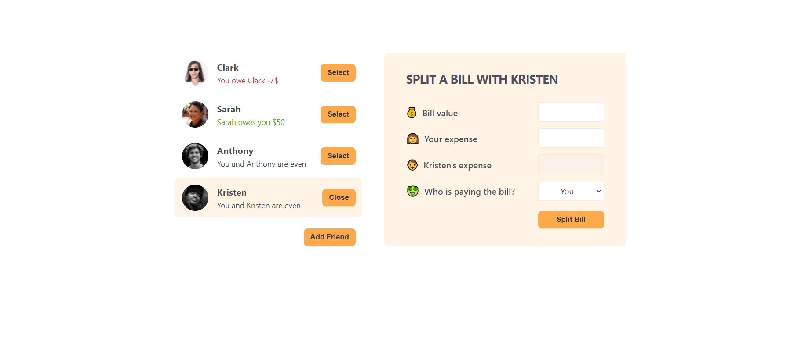

## Eat-'N-Split

Eat-'N-Split a react project website which is friends can keep their expense and their debt to each other. When you select a friend a list, the bill form will be opened. And the bill will be calculated acording to values of on the bill form. Also you can add a friend. I made this website with React.js. You can try by clicking <strong>[Eat-'N-Split](https://eat-and-split-gldn.netlify.app/)</strong>.

 

   
   
 
   
   
 
   
   
 
   
   
 
